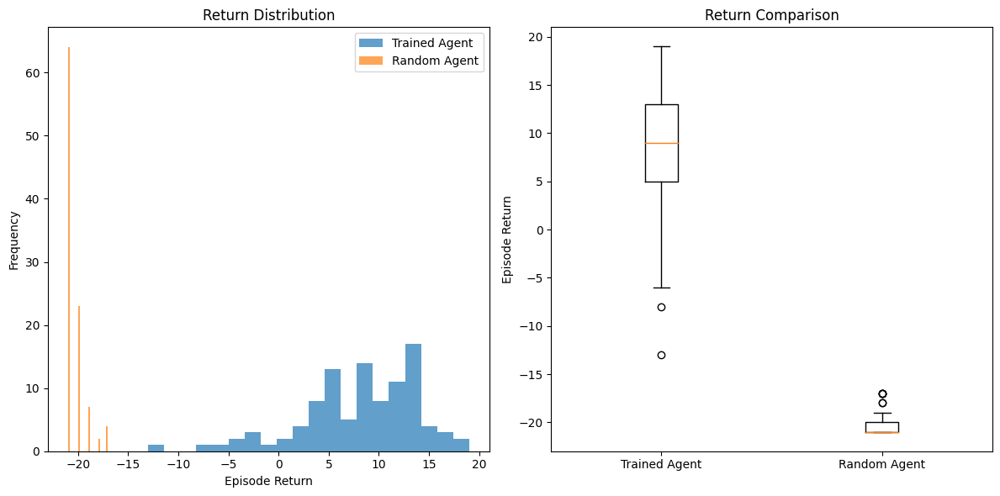

# ddqn-pong

This repository contains an implementation of the **Double Deep Q-Network (DDQN)** algorithm to train an agent to play the Atari game Pong using OpenAI Gym Library.

The implementation follows techniques from the papers:
- **[Playing Atari with Deep Reinforcement Learning](https://arxiv.org/abs/1312.5602)** and 
- **[Deep Reinforcement Learning with Double Q-learning](https://arxiv.org/abs/1509.06461)**

Training with google colab over 3 h and 900 episodes:

